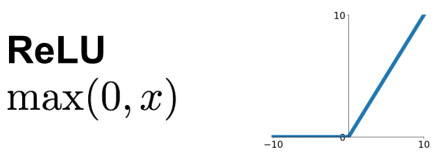
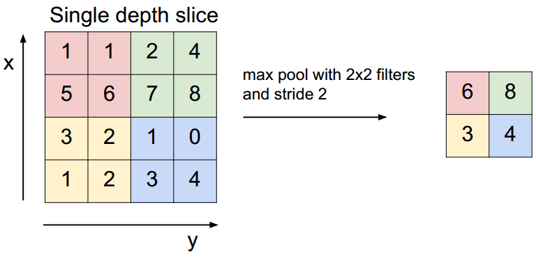
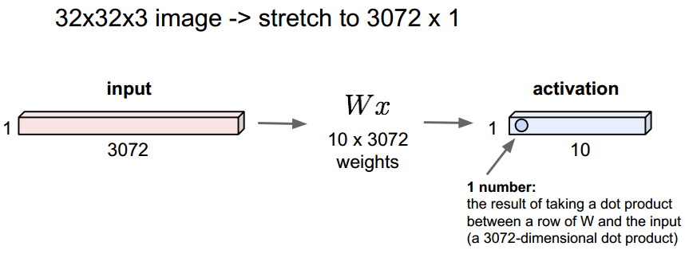
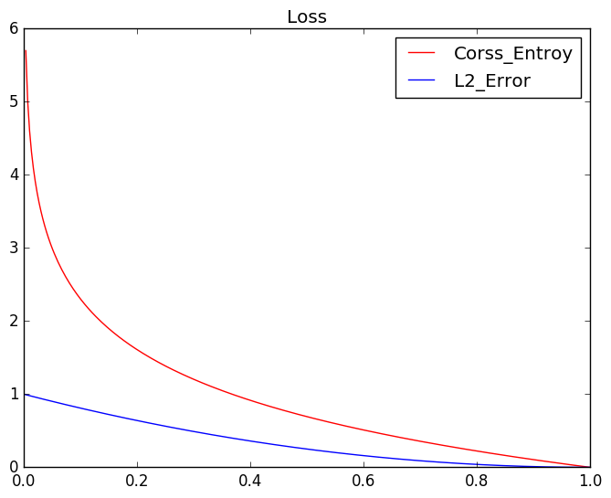

# 一些关于CNN的常识性知识 

## 1. 卷积岑conv layer
### 1.1 计算经卷积核之后的输出大小
输入数据维度 W×W

Filter大小 F×F 

步长S

padding像素数目P
(通常padding为0像素)

输出 N

$$ N = (W - F+2P)/S+1$$

>> 例子:
Input volume : 32×32×3
10 5×5 filters with stride 1 , pad 2 
Output volume size:
(32+2×2-5)/1+1 = 32 spatically,so 32×32×10 

### 1.2 计算卷积层中的参数
核大小　m*n

上一层通道数　d

此层核个数　ｑ

$$ paramcounts = [(m\times n )+1]\times q $$
## 2. 激活函数 
### 2.1 ReLu

## 3. pool 层

### 3.1 max_pool

## 4. Full-connect layer
### 4.1 

## 5. 代价函数 
### 5.1 交叉熵 
#### 第一步:softmax 求属于某一类的概率:

$$ softmax(x)_i = \frac{exp(x_i)}{\sum_{j}exp(x_j)}$$
输出向量:[batchsize,numclasses]
#### 第二步:

softmax的输出向量与样本的实际标签作一个交叉熵
$$H_y' = - \sum_{i}y_i'\times log(y_i)$$

 其中　ｙi'指实际标签中第i个值[0,0,1,0,0]

yi就是softmax的输出向量[y1,y2,y3，...]中第i个元素的值

显然yi越准确,结果的值越小(别忘记了前面的负号),最后求一个平均

### 5.2 为什么用交叉熵而不是欧氏距离 

从图中可以看出当模型对期望值输出为1的样本的预测值为0时惩罚的值会接近无穷大。这使得训练完成后模型不可能做出这样的错误预测。这使得交叉熵更适合作为模型的损失函数。